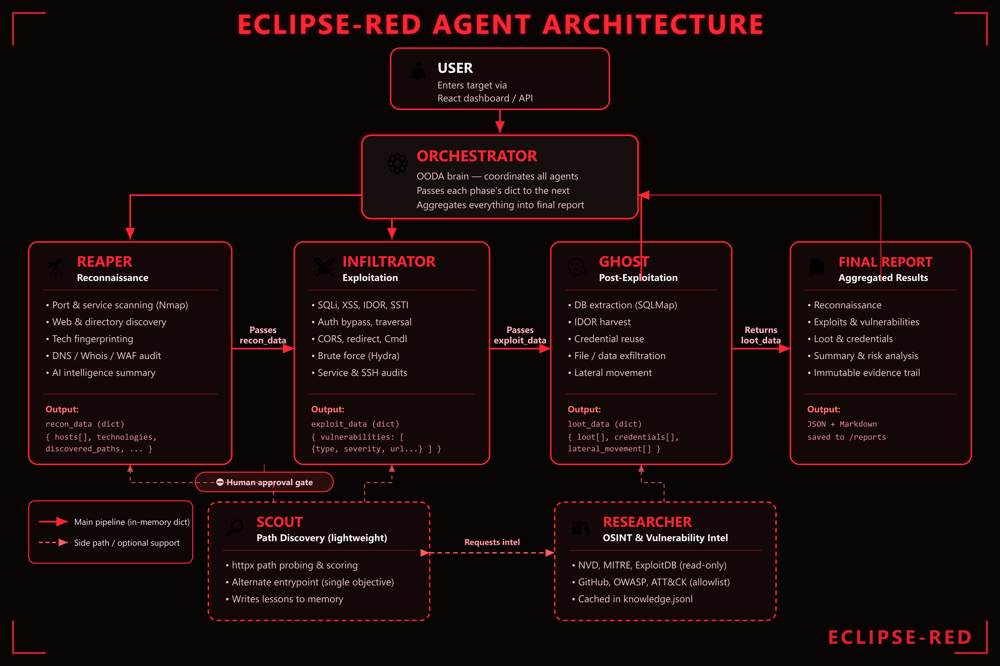
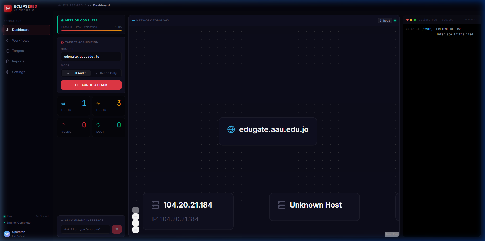
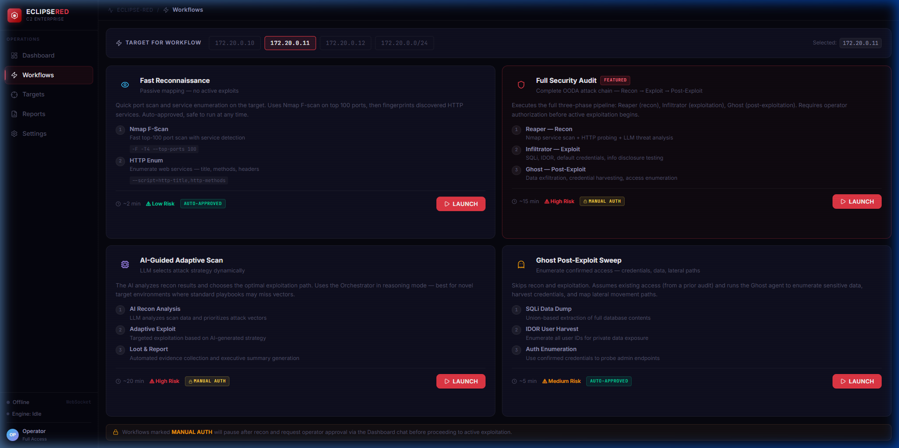
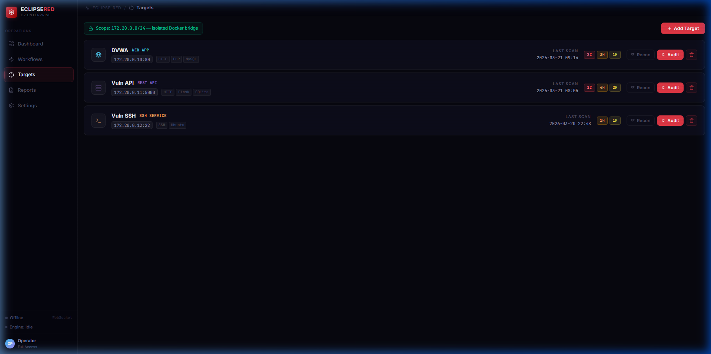

<div align="center">

# 🌑 ECLIPSE-RED
### Autonomous Agentic Red-Teaming Engine & Cyber Range

[](https://cer04.github.io/ECLIPSE-RED/)
[](https://cer04.github.io/ECLIPSE-RED/architecture.html)
[](docker-compose.yml)
[](https://python.org)
[](https://fastapi.tiangolo.com)
[](https://attack.mitre.org)
[](LICENSE)

<br/>

> **Autonomous offensive security system powered by multi-agent LLM reasoning that conducts end-to-end reconnaissance, vulnerability weaponization, and post-exploitation within an isolated, sandboxed cyber range.**

[🌐 Explore Live Site](https://cer04.github.io/ECLIPSE-RED/) · [🏛️ System Architecture](https://cer04.github.io/ECLIPSE-RED/architecture.html) · [👥 Research Team](https://cer04.github.io/ECLIPSE-RED/team.html) · [⚡ Quick Start](#-quick-start)

<br/>



</div>

---

## ⚡ The Paradigm Shift: Beyond Legacy Scanners

Traditional vulnerability scanners (Nessus, OpenVAS, Burp Active Scanner) test signatures blindly:
* ❌ **Blind CVE checks** without contextual awareness.
* ❌ **Thousands of unverified false positives** wasting analyst hours.
* ❌ **Inability to chain vulnerabilities** (e.g. chaining low-severity info disclosure → IDOR → SQLi → Remote Code Execution).
* ❌ **Zero business-logic comprehension** (e.g., bypassing price checks or state-machine sequence flows).

**ECLIPSE-RED** replaces static scanners with a **coordinated swarm of intelligent AI agents operating in an OODA (Observe–Orient–Decide–Act) loop**:

```
                  ┌──────────────────────────────────────────────┐
                  │          OBSERVE (Telemetry & OSINT)         │
                  │   Passive banners · Ports · HTTP Headers     │
                  └──────────────────────┬───────────────────────┘
                                         ▼
                  ┌──────────────────────────────────────────────┐
                  │         ORIENT (LLM Attack Graph Context)    │
                  │  Vector DB · MITRE ATT&CK Mapping · CVE Cor. │
                  └──────────────────────┬───────────────────────┘
                                         ▼
                  ┌──────────────────────────────────────────────┐
                  │          DECIDE (Orchestrator Brain)         │
                  │ Strategic task allocation · Safety boundaries│
                  └──────────────────────┬───────────────────────┘
                                         ▼
                  ┌──────────────────────────────────────────────┐
                  │            ACT (Precision Executors)         │
                  │   Dynamic payload synthesis · Proof of Viab. │
                  └──────────────────────────────────────────────┘
```

---

## 🤖 The Intelligent Swarm

ECLIPSE-RED decomposes offensive operations across specialized agents, preventing LLM hallucinations and enforcing separation of concerns:

| Agent | Codename | Primary Mission | Tools & Execution | MITRE ATT&CK Mapping |
|---|---|---|---|---|
| **Reaper** | 🔍 Recon & OSINT | Network mapping, passive banner harvesting, surface enumeration | Nmap, Nuclei, Mitmproxy, HTTP Probing | **T1595** (Active Scanning), **T1046** (Network Service Discovery) |
| **Infiltrator** | ⚔️ Weaponizer | Contextual payload synthesis, WAF bypass, SQLi, IDOR, auth exploitation | Custom Python engines, Sqlmap, Payload LLM generator | **T1190** (Exploit Public-Facing App), **T1059** (Command Interpreter) |
| **Ghost** | 👻 Post-Exploitation | Lateral movement, memory dumping, credential harvesting, persistence check | Linux API probes, DB extractors, Privilege audit | **T1082** (System Info Discovery), **T1003** (Credential Dumping) |
| **Scout** | 🎯 Surgical Verifier | Low-noise target verification, single-vector exploit confirmation | Custom async socket probes, headless HTTP client | **T1071** (Application Layer Protocol) |
| **Researcher** | 📚 Threat Intel | Real-time CVE database interrogation, ExploitDB scraping, patch analysis | NVD API, VulnDB, ExploitDB vector retrieval | **T1592** (Gather Victim Host Info) |
| **Orchestrator** | 🧠 Swarm C2 Brain | Global mission coordination, state persistence, safety allowlist guard | FastAPI, WebSockets, Celery task timeouts, LangChain | **Command & Control** Framework |

---

## 🖥️ Live C2 War Room Dashboard

ECLIPSE-RED features a real-time reactive Command & Control interface providing visual telemetry, streaming attack logs, and target topology mapping:

<div align="center">
  
</div>

### Interactive Workflows & Target Management
<div align="center">
  <table>
    <tr>
      <td width="50%"><br/><b>Pre-Configured Attack Workflows</b></td>
      <td width="50%"><br/><b>Target Inventory & Range Segmentation</b></td>
    </tr>
  </table>
</div>

---

## 🏗️ Architecture & Cyber Range Segmentation

ECLIPSE-RED implements strict zero-trust boundary isolation between the Control Plane and the Target Plane:

```
┌────────────────────────────────────────────────────────────────────────┐
│  CONTROL PLANE (control-net)                                           │
│  ┌──────────────────────────────────────────────────────────────────┐  │
│  │  Backend C2 Engine (FastAPI + WebSocket Broadcast)               │  │
│  │  • JWT Auth & RBAC               • CIDR Allowlist Guard          │  │
│  │  • Rate Limiting (5 req/min)     • Global Job Timeout (300s)     │  │
│  │  • CWE-88 Shell Injection Guard  • Non-root process execution    │  │
│  └───────────────────┬──────────────────────┬───────────────────────┘  │
│                      │                      │                          │
├──────────────────────┼──────────────────────┼──────────────────────────┤
│  TARGET PLANE (target-net: internal=true, non-routable)                │
│                      │                      │                          │
│  ┌───────────────────▼──────┐ ┌─────────────▼──────┐ ┌──────────────┐  │
│  │  DVWA Vulnerable App     │ │ Vuln-API Target    │ │ SSH Honeypot │  │
│  │  172.20.0.10:80          │ │ 172.20.0.11:5000   │ │ 172.20.0.12  │  │
│  │  Web & XSS attack tests  │ │ SQLi, IDOR, Auth   │ │ Weak Creds   │  │
│  └──────────────────────────┘ └────────────────────┘ └──────────────┘  │
└────────────────────────────────────────────────────────────────────────┘
```

> **Network Isolation Guarantee**: Target containers are connected to an internal Docker network with `internal: true`. They cannot initiate or receive connections to the public internet, preventing any inadvertent external network leakage.

---

## 🔒 Security & Safety Controls

ECLIPSE-RED is engineered with offensive safety controls to guarantee contained and safe testing:

1. **CIDR Allowlist Enforcement**: Every scan target must pass an IP/CIDR validation check matching `ECLIPSE_ALLOWED_CIDRS` (e.g., `172.20.0.0/24`). Outside ranges are rejected before spawning subprocesses.
2. **CWE-88 Argument Injection Protection**: Target parameters are rigorously sanitized; shell flag injections (e.g. `-oN`, `--script`) are strictly disallowed.
3. **Role-Based Access Control (RBAC)**: All scan execution requires an `operator` or `admin` JWT bearer token.
4. **Execution Timeouts**: Global watchdog timer terminates jobs after 300 seconds; individual agent phases time out after 120 seconds.
5. **Non-Root Execution**: Backend and agent containers run as unprivileged users (`UID 1000`).

---

## 🚀 Quick Start

### 1. Prerequisites
* **Docker Desktop** (Engine 24.0+)
* **Python 3.11+**
* **Local LLM**: [Ollama](https://ollama.ai) with `dolphin-llama3` or OpenAI API key

### 2. Clone & Spin Up
```bash
# Clone the repository
git clone https://github.com/cer04/ECLIPSE-RED.git
cd ECLIPSE-RED

# Copy environment variables
cp .env.example .env

# Launch the isolated cyber range
docker compose up -d
```

### 3. Authenticate & Obtain JWT
```bash
curl -X POST http://127.0.0.1:8000/auth/login \
  -H "Content-Type: application/json" \
  -d '{"username": "admin", "password": "Eclipse2026!"}'
```

### 4. Trigger Autonomous Scan
```bash
curl -X POST http://127.0.0.1:8000/scan \
  -H "Authorization: Bearer <YOUR_JWT_TOKEN>" \
  -H "Content-Type: application/json" \
  -d '{"target": "172.20.0.11"}'
```

### 5. Stream Real-Time Telemetry
Connect to the WebSocket stream to watch the swarm execute:
```
ws://127.0.0.1:8000/ws?token=<YOUR_JWT_TOKEN>
```

---

## 👥 Academic & Research Attribution

This project is developed as a **Bachelor of Cybersecurity Graduation Project** at Al-Ahliyya Amman University (2026).

| Operator | Role | Specialization | GitHub |
|---|---|---|---|
| **Laith Hussam Naser** | **Lead AI Architect** | Swarm Orchestration, LLM Decision Trees, Prompt Engineering | [@cer04](https://github.com/cer04) |
| **Wa'ed Mohammed Smhan** | **Offensive Engineer** | Toolchain Weaponization, Subprocess Guardrails, Metasploit/Nmap APIs | [@cer04](https://github.com/cer04) |
| **Abdallah Ahmad Muawad** | **C2 Systems Lead** | War Room Dashboard, Real-time Visual Telemetry, WebSocket Bridge | [@cer04](https://github.com/cer04) |

---

## 📜 License & Ethical Disclaimer

This project is licensed under the **MIT License** — see the [LICENSE](LICENSE) file for details.

> **⚠️ ETHICAL & LEGAL NOTICE**: ECLIPSE-RED is strictly intended for educational, academic, and authorized defensive evaluation purposes within controlled sandbox environments. The authors assume no liability for misuse or actions performed outside authorized legal boundaries.